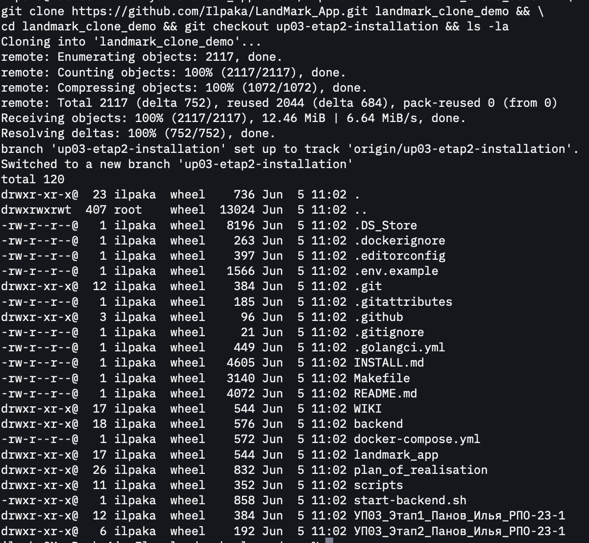
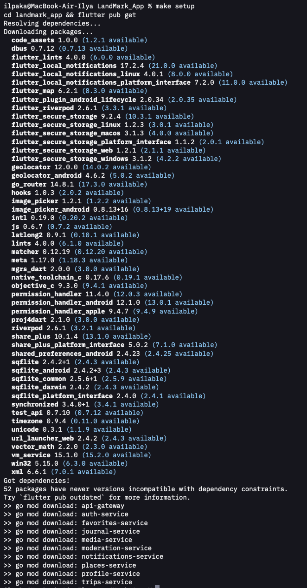
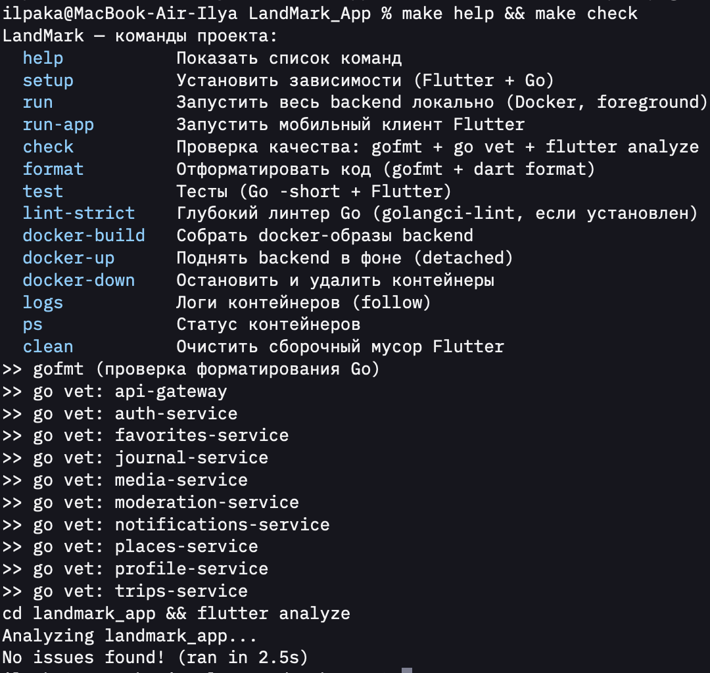
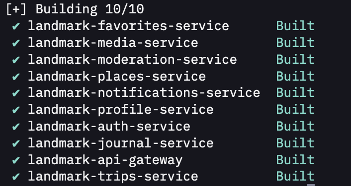
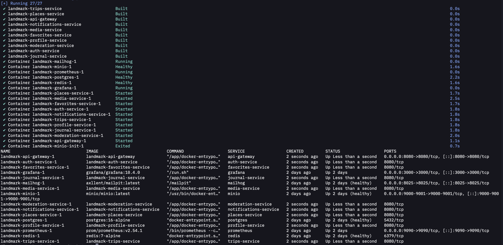
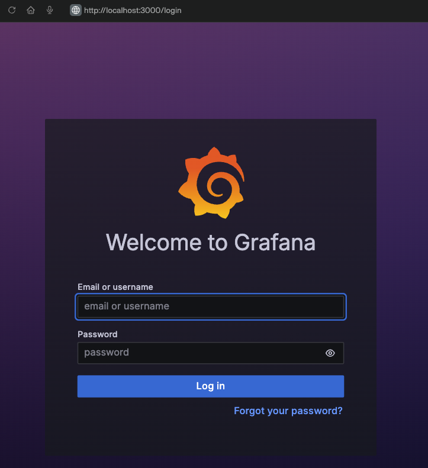
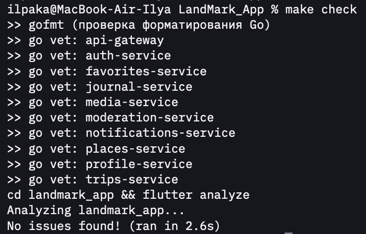
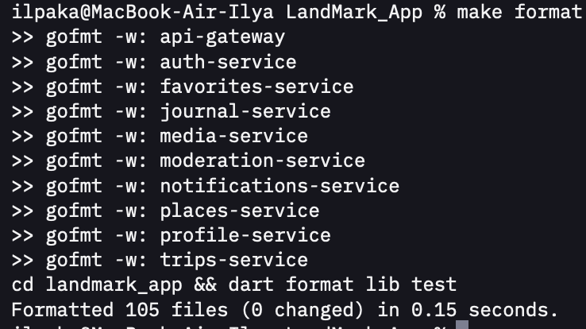
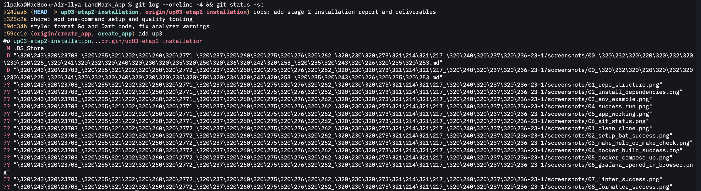

# УП.03 · Этап 2. Проведение инсталляции ПО компьютерных систем

Проект **LandMark (Wanderlog)** — мобильное приложение (Flutter) + backend
(10 Go-микросервисов в Docker). На этом этапе настроены единые команды запуска,
проверки и форматирования.

- **Репозиторий:** https://github.com/Ilpaka/LandMark_App
- **Короткий отчёт:** [`docs/01_Короткий_отчет_по_этапу_2.docx`](docs/01_Короткий_отчет_по_этапу_2.docx)
- **Файлы в репозитории:** Makefile, `scripts/*.bat`, `docker-compose.yml`,
  `.dockerignore`, `.env.example`, `.editorconfig`, `.golangci.yml`, `INSTALL.md`

## Как запустить (кратко)

```bash
make setup        # установка зависимостей (Flutter + Go)
make docker-up    # поднять backend в Docker
make run-app      # запустить мобильный клиент
make check        # go vet + flutter analyze
make format       # gofmt + dart format
```

На Windows — те же действия через `scripts\*.bat`.

## Скриншоты проверки

### 1. Клонирование проекта в новую папку


### 2. Установка зависимостей (setup)


### 3. Команды Makefile / проверка `make check`


### 4. Успешная сборка Docker-образов


### 5. Запущенные сервисы (`docker compose up --build`)


### 6. Программа открыта в браузере (Grafana)


### 7. Линтер: «No issues found»


### 8. Форматтер (`make format`)


### 9. Коммит и push в ветку

