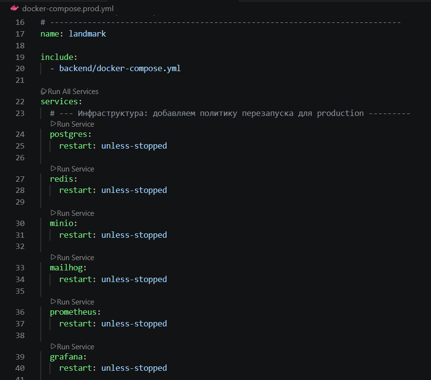
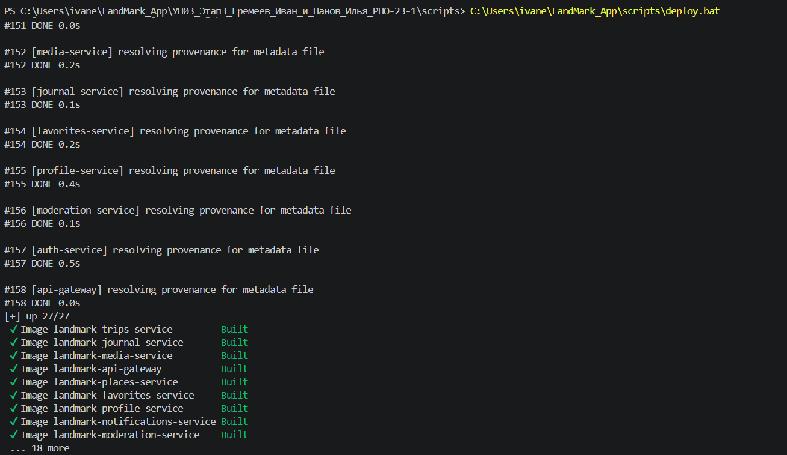
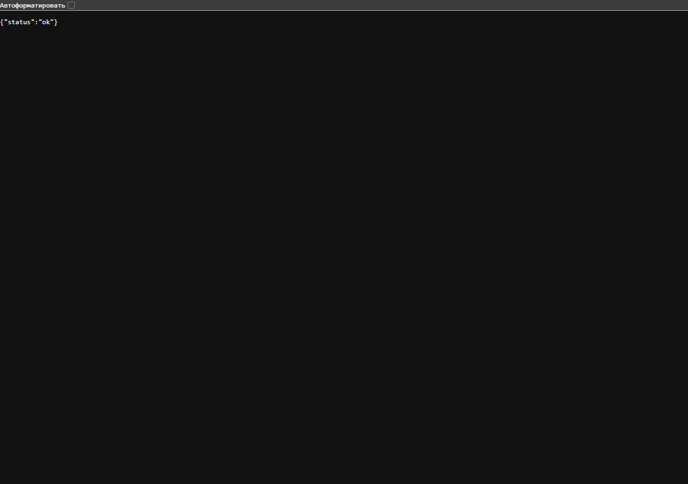
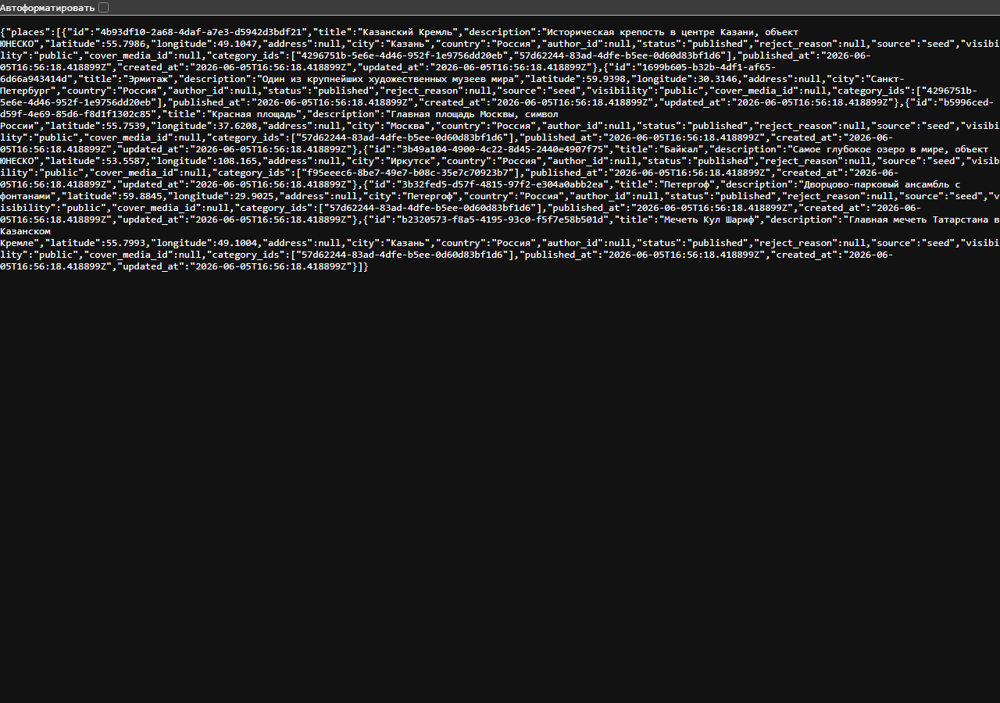
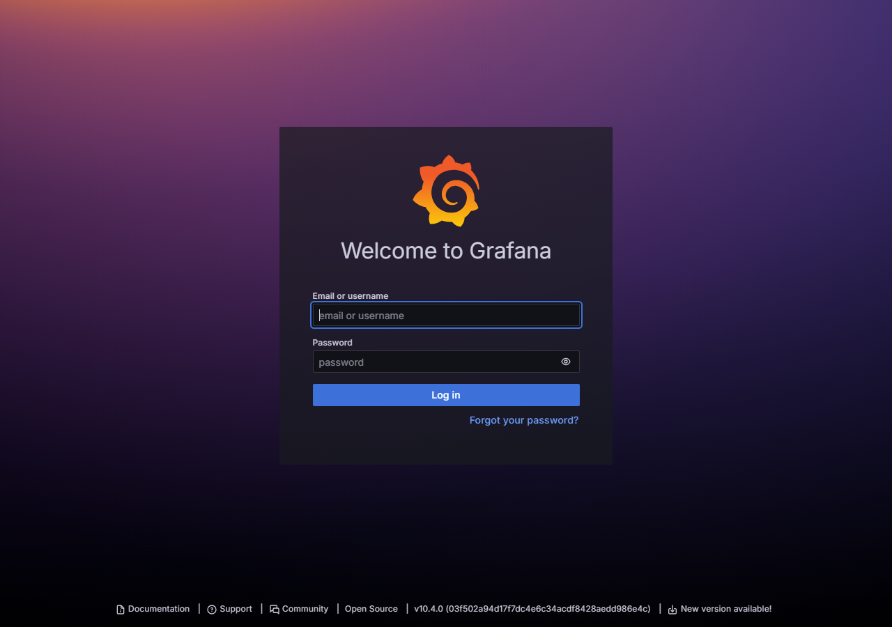

# УП.03 · Этап 3. Развертывание проекта как сервиса / готового билда

Проект **LandMark (Wanderlog)** — мобильное приложение (Flutter) + backend
(10 Go-микросервисов в Docker). На этом этапе проект подготовлен к
развертыванию **вне среды разработки**: добавлены production/demo-конфигурация,
команды развертывания, проверка доступности, перезапуск и демонстрация.

- **Репозиторий:** https://github.com/Ilpaka/LandMark_App
- **Ветка этапа 3:** `feat/third_stage`
- **Вариант развертывания:** C — локальный demo-стенд через Docker
  (`docker compose -f docker-compose.prod.yml up -d`)
- **Короткий отчёт:** [`docs/01_Короткий_отчет_по_этапу_3.docx`](docs/01_Короткий_отчет_по_этапу_3.docx)
- **Документация:** [`docs/DEPLOYMENT.md`](docs/DEPLOYMENT.md),
  [`docs/DEMO_GUIDE.md`](docs/DEMO_GUIDE.md),
  [`docs/RELEASE_NOTES.md`](docs/RELEASE_NOTES.md)

## Как развернуть (кратко)

```bash
git checkout feat/third_stage
cp .env.demo.example .env.production
docker compose --env-file .env.production -f docker-compose.prod.yml up --build -d
# проверка: http://localhost:8080/healthz  ->  HTTP 200
```

На Windows — одной командой: `scripts\deploy.bat`
(перезапуск — `scripts\restart.bat`, проверка — `scripts\check_deploy.bat`).

## Что добавлено в репозиторий

- `docker-compose.prod.yml` — production/demo-запуск всего backend;
- `.env.production.example`, `.env.demo.example` — примеры переменных без секретов;
- `scripts/deploy.bat`, `restart.bat`, `check_deploy.bat`, `build_release.bat`
  (+ `deploy.sh`, `restart.sh`);
- `DEPLOYMENT.md`, `DEMO_GUIDE.md`, `RELEASE_NOTES.md`;
- `deploy/nginx/landmark.conf`, `deploy/systemd/landmark.service` — примеры для VPS.

## Скриншоты проверки

> Скриншоты делаются на машине с запущенным Docker (инструкция —
> [`screenshots/КАК_СДЕЛАТЬ_СКРИНШОТЫ.txt`](screenshots/КАК_СДЕЛАТЬ_СКРИНШОТЫ.txt)).

### 1. Production/demo-переменные окружения


### 2. Файлы развертывания


### 3. Успешная команда развертывания


### 4. Сервисы запущены (running)


### 5. Приложение доступно вне IDE


### 6. Логи без критических ошибок


### 7. Основной сценарий работает


### 8. Остановка и повторный запуск


### 9. Адрес стенда / release-билд

